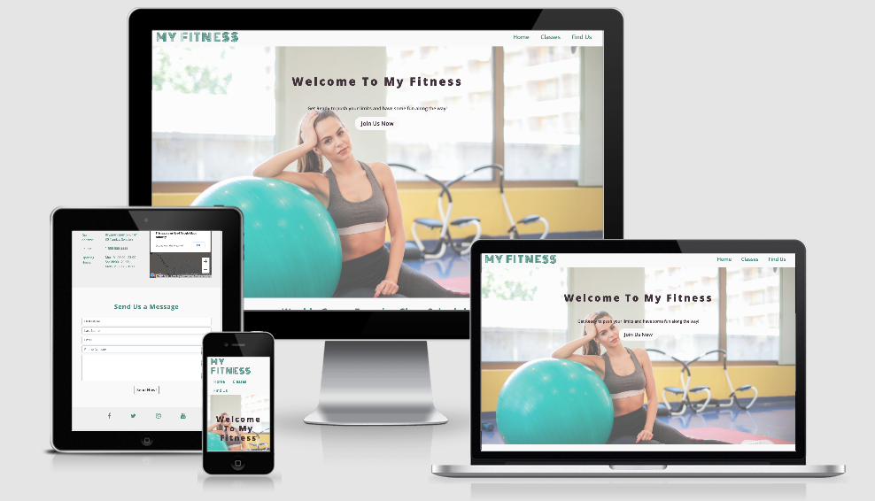

# **User Centric Frontend Development Milestone My Fitness Project:**

My Fitness is website designed to brand "my fitness gym" and attract new clients by presenting the services the gym provides with links on how to join classes schdeule and reviews, the website designed as one pages with quick links to provide you with the information you require easily plus its responsive and it does work on any device.

# **UX** 

**as a user:**
- will be able to join the gym by filling a form.
- will be ablt to find the weekly classes schedule.
- will be able to check other users reviews.
- will be able to navigate thru google maps to find the gym locationa.
- will be able to find the gym contact details.

**as website owner:**
- provide the users with all weekly classes schedule.
- provide the users with other users reviews.
- provide the users with contact details.
- provide the users with responsive google map tool to navigate easily the surrounding area of the gym.

## **Wireframes**:
the website was designed by Balsamiq tool, click here to check it out.

# Features:
## Existing Features:
- Navigation menu bar that linked to different sections in the  website
- Join us botton in the middle of the main page that linked to a form.
- The weekly classes schedule table with responsive design it can be scrolled horizontally when there is no enough space on the screen.
- Clickable logo that reload the page.
- Reviews of happy users with a photo beside it.
- Location of the gym on google maps, users can naviagte to check the gym location  or maybe drive to.
- Form that includes all the personal details of users plus their messages, the "send now" button will reload the page.
- Footer that links to all social media channels.

## Futute Features:
- functiong form that send the user details to a back end system with auto reply (confirmation email).

# Technology Used:
## Front-End Languages: 
HTML5, CSS3
## Frameworks:
### Bootstrap:
-the griding responsive design.
-the join us botton.
### Balsamiq:
designed the wireframes.
### VSCode:
this whole project written by vscode.
### Fontawesome:
used to design the icons in the footer.
### Github:
the whole project commited and pushed to github repository and published on Github pages.

# Testing:

